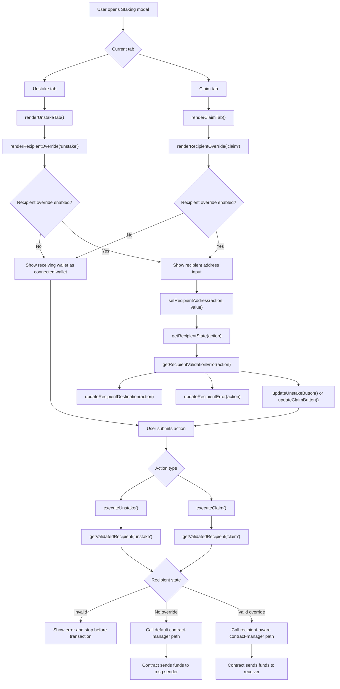
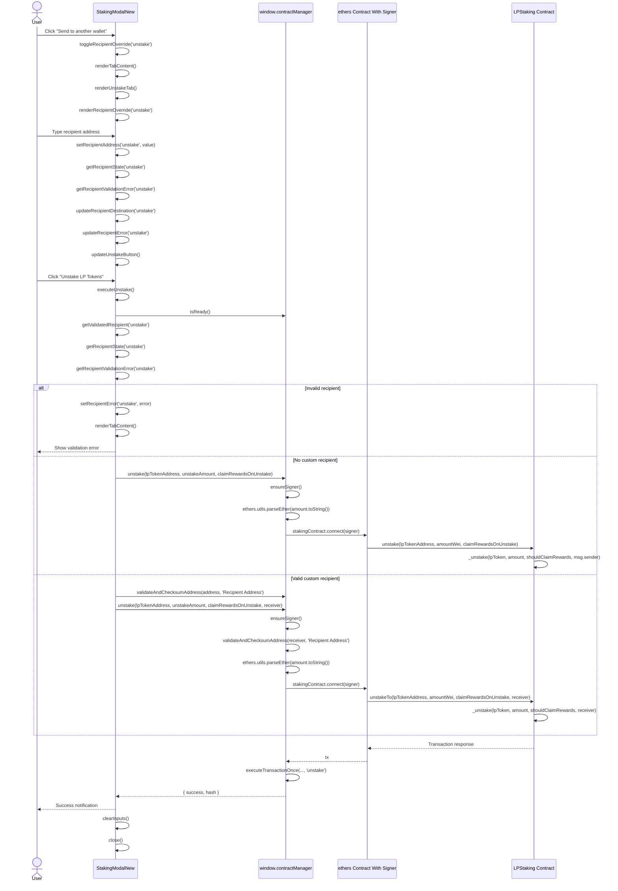
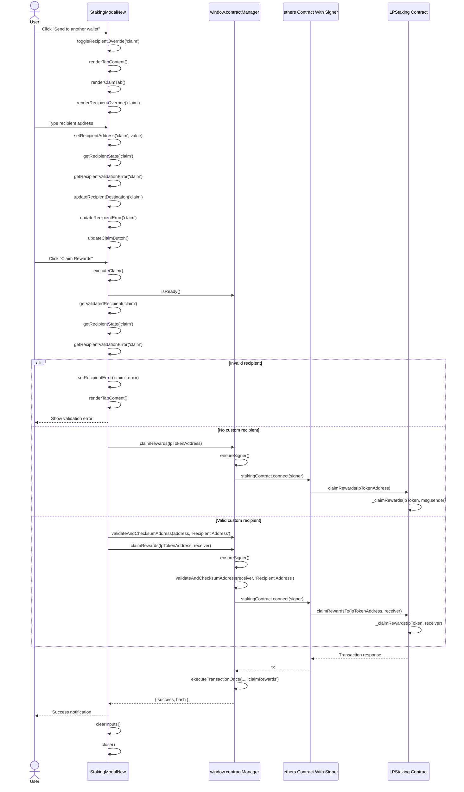

# Recipient-Aware Unstake and Claim Flow

## What Changed

This branch adds recipient-aware unstake and claim support in four layers:

1. Contract-manager transaction plumbing
   - `ContractManager.claimRewards(lpTokenAddress, recipientAddress = null)` keeps calling `claimRewards(lpTokenAddress)` by default.
   - When a recipient is provided, it validates/checksums the address and calls `claimRewardsTo(lpTokenAddress, receiver)`.
   - `ContractManager.unstake(lpTokenAddress, amount, claimRewards, recipientAddress = null)` keeps calling `unstake(lpTokenAddress, amountWei, claimRewards)` by default.
   - When a recipient is provided, it validates/checksums the address and calls `unstakeTo(lpTokenAddress, amountWei, claimRewards, receiver)`.

2. Modal rendering and local state
   - The Unstake and Claim tabs now render a hidden-by-default advanced recipient control.
   - Default state shows `Receiving wallet: Connected wallet`.
   - Clicking `Send to another wallet` reveals a recipient address field.
   - Clicking `Send to connected wallet` or `Clear` collapses the field and clears the override.
   - The recipient toggle is right-aligned in the recipient area and uses a neutral grey treatment instead of the red/destructive button color.
   - Recipient validation errors render below the input with dedicated spacing so the warning does not overlap the address field.
   - Recipient state is separate for Unstake and Claim:
     - `unstakeRecipientEnabled`
     - `unstakeRecipientAddress`
     - `unstakeRecipientError`
     - `claimRecipientEnabled`
     - `claimRecipientAddress`
     - `claimRecipientError`

3. Modal submission wiring
   - `executeUnstake()` and `executeClaim()` validate the custom recipient only when the override is enabled.
   - While typing, the modal uses `window.ethers.utils.isAddress(...)` for local validation.
   - On submit, the modal asks `window.contractManager.validateAndChecksumAddress(...)` for the final checksummed receiver.
   - Malformed recipient addresses block submission before wallet approval.
   - Valid custom recipients are passed into `window.contractManager.unstake(...)` or `window.contractManager.claimRewards(...)`.
   - If no override is enabled, the original function signatures and default connected-wallet behavior remain unchanged.
   - `clearInputs()` resets both recipient override states after a completed action.

4. Styling
   - `.recipient-override` stacks the destination label, toggle button, and optional recipient field.
   - `.recipient-toggle` is `align-self: flex-end`, so the button stays right-aligned within the recipient block.
   - `.recipient-toggle` uses grey colors (`#4a5568`, `#64748b`, `#94a3b8`) for normal and hover states.
   - `.zap-field-error.recipient-error` adds vertical spacing below the input to keep validation text readable.

## High-Level Flow

## Unstake Sequence

## Claim Sequence

## Default Versus Custom Recipient Behavior

| User choice | Modal call | Contract-manager call | Contract call | Receiver |
| --- | --- | --- | --- | --- |
| Unstake without override | `executeUnstake()` | `unstake(lpToken, amount, shouldClaimRewards)` | `unstake(lpToken, amountWei, shouldClaimRewards)` | Connected wallet / `msg.sender` |
| Unstake with override | `executeUnstake()` | `unstake(lpToken, amount, shouldClaimRewards, receiver)` | `unstakeTo(lpToken, amountWei, shouldClaimRewards, receiver)` | Custom receiver |
| Claim without override | `executeClaim()` | `claimRewards(lpToken)` | `claimRewards(lpToken)` | Connected wallet / `msg.sender` |
| Claim with override | `executeClaim()` | `claimRewards(lpToken, receiver)` | `claimRewardsTo(lpToken, receiver)` | Custom receiver |

## Important Contract Detail

The recipient-aware methods do not move stake ownership. The connected wallet remains the staker because the contract uses `msg.sender` for accounting. The custom `receiver` only changes where the returned LP tokens and/or claimed LIB rewards are transferred.
